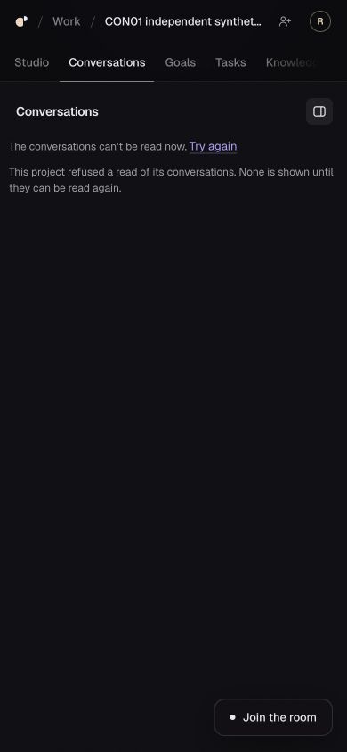

# CON-01 CX-0084 — focus correction qualified locally; probe-order limits preserved

Independent reviewer, attempt 1. Current feature **d92323b0a15f867c2ff4d5d620c123307299aa96**, tree **d530d04eda59d4e1afda240cd5ce598deffd78e8**, parent a7044690. Current main **b69a6a0bf19630b5f6e08a37b02e0b5a234dbbb9**. #199 is draft at d923; #226 remains frozen/draft at 3b1a7ea6. [Structured evidence](CX-0084.evidence.json), [safe receipts](evidence/20261011-cx84-focus-and-probe-limits/). No feature fix authored by reviewer.

Previous CX83 was progress. This checkpoint makes new progress: independently inspected the complete focus delta, exercised actual PostgreSQL/API/Studio phone crossings and recovered the terminal old combined gate. It does not treat missing live inputs as permission or mark the goal/product complete.

## Exact source and review

Fetched exact d923, created a clean detached independent worktree `sophia-con01-focus-review` (no branch reset). Complete 2-file +57/-2 delta read: ConversationsView +31/-2 and removal regression spec +26. `useFenceFocus` tracks document focusin inside the view, moves focus to the refusal note only when the fence removed it, and leaves focus still in the view alone. Frozen offline install and Studio typecheck exit 0. Source clean before owned launch and after cleanup.

Independently read bot r4239578617 and author CC79/6103333624. Its claim that `shown` stays truthy when fenced is inconsistent with the actual path: useShown returns NONE, useChosen(NONE) has no open conversation, shown is undefined, screenOf returns list. Actual browser evidence below confirms this for the named cases. This is a scoped adjudication, not approval of all G3 or a deployed app claim. Author phone fixtures were not substituted for the independent check.

## Actual episode 78 — real local app, no fixtures

Studio65511/API65510/PostgreSQL17.6, project84a27af4-bc9c-426e-a9a7-da56bffaa8ea, current conversatione0b9ef84-5a3b-4dc7-868f-f92921feab7a. Synthetic local dev JWT identities, not the required hosted accounts. Main App sign-in, Work/Open and Conversations navigation; no injected fixture or app-store mutation. Home project press initially did not navigate; Work/Open did. No root cause or unrelated feature verdict inferred.

390x844 viewport. Private harness bound exact SHA/tree and clean source before PG creation, 8-minute inner/600-second outer lifetime and 200 conversation-read ceiling armed before launch. Effects limited to owned disposable PostgreSQL: initial four human messages; three separately keyed human-only editor feed stimuli; exact synthetic membership remove/restore pairs. Every message has askSophia=false. No Ask/Start/erasure/proposal/approval UI write, native/provider/hosted effect or paid work.

- **Composer scoped PASS.** Focused textarea held `SYNTHETIC phone focus draft`, data-screen=thread at00:33:21.477. First feed stimulus with snapshot reads blocked did not advance the view; preserved as no-crossing control, not a failure or pass. Unblocked snapshot and issued second human-only stimulus. Original list request was forwarded to actual API only after exact member removal, cursor6->6; actual list403 at00:33:45.695, preceding thread200 at45.692. At00:33:49.257 DOM had data-screen=list, active P with the refusal note, no conversation/composer. Subsequent parent snapshot correctly denied the entire project before a screenshot was saved; that image is labelled later-parent-denied, not evidence of the earlier focused note. Exact restore00:34:12.887, actual app return/fresh list200, original draft retained.
- **New-form sibling scoped PASS.** Focused Question held `SYNTHETIC phone form question`, context `SYNTHETIC phone form context`, screen=thread at00:34:56.891. Third separately keyed human feed stimulus; original list GET triggered exact member removal00:35:02.931, cursor7->7, then real API403. A bounded private watcher blocked subsequent snapshot reads after this actual revocation so the parent gate could not mask the form crossing. At00:35:09.664 screen=list; refusal P focused, visible rectangle x10/y184/w370/h36; no form, draft words, rows, transcript or write controls. Screenshot independently inspected. Exact restore00:35:15.048 plus explicit list Try again actual200 restores both original fields/form. Start was never pressed.

Quiesced audit00:35:34.957: **7 human messages/0NULL/7 requests/0 replies/0 decisions**, bootstrap goal1 and jobs/attempts/bindings/commands/outbox/runtimecommands/usage0. Thus the three human stimuli created no model/operational work. Both exact membership changes reconciled; no unknown local write. Wrapper36126 terminal0; API/Studio stopped before audit0; DB dropped/PG stopped/cluster removed. Independent PIDs41184/41220/41230/41231 absent, ports65510/65511 closed, tab101 closed, viewport reset.

## Earlier bounded episodes 76/77 — ordering remains inconclusive

Both were actual owned local Studio/API/PG at a704/tree523bb586, capped203-conversation setup, no fixtures/provider/native. Their safe receipts are retained alongside this checkpoint; do not transfer their results to d923.

76: first actual C1 thread200 buffered22:24:03.603; capped list200 at03.616 and a subsequent reconciliation probe200 at03.737 was unheld. Exact revoke22:24:10.011 cursor207->207, actual list40322:24:14.539/fence DOM14.746; original bytes released15.605 with clientAlreadyClosed=true, no finish. Later fence stayed, but no consumed late200 crossing: **INCONCLUSIVE**. Restore22:24:46.645; final207human/207requests/0NULL/0replies/all model-op counters0, 15/200reads. Wrapper13568 terminal0; own DB/PG/PIDs/ports/tab99 cleaned.

77: instrumentation allowed first own-thread20022:25:51.288, held the actual subsequent probe20051.384; original bytes relayed22:26:03.387 clientAlreadyClosed=false/finish03.388. CUA Try again wait ended at its tool deadline; no membership removal/newer403 before release, no privacy crossing. The loop remained bounded and settled automatically at22:33; **INCONCLUSIVE** for ordering, successful instrumentation control only. Final207human/207requests/0NULL/0replies/all model-op counters0,17/200reads. Wrapper45762 terminal0; own DB/PG/PIDs/ports/tab100 cleaned. Node finish proves transport handoff, never browser consumption; original harness receipt prose does not upgrade this verdict.

All 78 owned app stacks are now cleaned. Private content-bearing audits and auth material remain outside Git; only synthetic DOM/screenshots and whitelisted safe receipts/aggregate audit were copied. No third attempt was made on a704. Episode78 was justified by new d923 source and addresses focus only, not late-order proof.

## Author gates and moving main

Fully read CC76 terminal6103078029: exact old combined3b1a/tree2718 ran uninterrupted, check/PG/db-all/SQL/focused170 all0; fullStudio exit1 at22:56:19,1212pass/1skip/1FAIL C9 report-page134 (PDF missing16cells). Cause unestablished and unwaived; old source also contains confirmed list403P1. CI app-auth/personal failures on superseded heads remain recorded/unexplained; no rerun or flake waiver.

Read CC77 terminal6103151536 and CC78 source/terminal6103242381/6103297394: a704 fail-before3/3fail vs9/9after, terminalall0; d923focus6/6fail-before vs6/6after, terminal1212unit/174focused/22PG/10APIall0. These are author L1 evidence, not independent native/hosted acceptance. #218 docs now published0a91caa0/tree8cc4a52e; S1/S2 ownership unchanged.

Exact Claude task observed00:29+: combined342288a2360843e84593aaed95c1d6423b7c8681/treecc8aa3c26bf0acd821084ece0e0cc92ae6419752 on mainb69 +CONd923 +S1 +docs, local/unpublished, fullgate still running at59min. No interrupt/restart or PR226 ref movement. This combined has NOT been fetched/reviewed/qualified independently. Main #225 changed signed-in startup (8files+140/-14); new main integration needs affected review. d923 CI at00:35 still queued/running, not green. #190 refreshed, stilldraft/open d90d2dc2, independent mission not completed here.

## Durable handoff and next bound

All36 full acceptance-case statuses retained. A25 latest checkpoint now includes these scoped focus/mobile passes; late-order/fullG3/G4/native/provider/hosted cases remain unqualified. source_ready true for d923; locally_verified only named crossings; scoped_delta_reviewed true; reviewed/authorized/deployed/app_verified/owner_accepted false.

OP1r2/OP2r2 remain draft_not_authorized, approval/expiry NULL. No operation approved/executed. User choices D6/B1/subscriptions/new synthetic account remain retained. Still missing actual owner-controlled inbox/account subjects/cohort, selected compatible subscription route/credential references/payer/finite allowance/expiry/provider retention bounds, named shared-runtime owner/window and governed combined rollback. No fake quota monitoring or API/PAYG fallback. Pending inbox question is not answered by elapsed time. No repeat question here.

Live serving tuple has NOT been refreshed this checkpoint; use LIVE_PREFLIGHT's dated last observations, not local65510/65511 or author's gate as a production identity. No live migration/config/cohort/deployment/provider/native/spend/rollback; prior installed composition and six reported running bindings must be recensused before a concrete batch. Rollback availability remains unqualified. Local data is disposed; no cleanup of governed live data inferred.

**One next bounded action:** obtain the immutable342288a2 combined source/tree/ownership delta and terminal gate handback, then independently inspect current-main integration and affected cases. No merge until its source/current review/checks qualify, and no deployment or hosted/native account creation/test until a fully bound effect batch is approved. Davide retains final product decision; other missions remain open.
