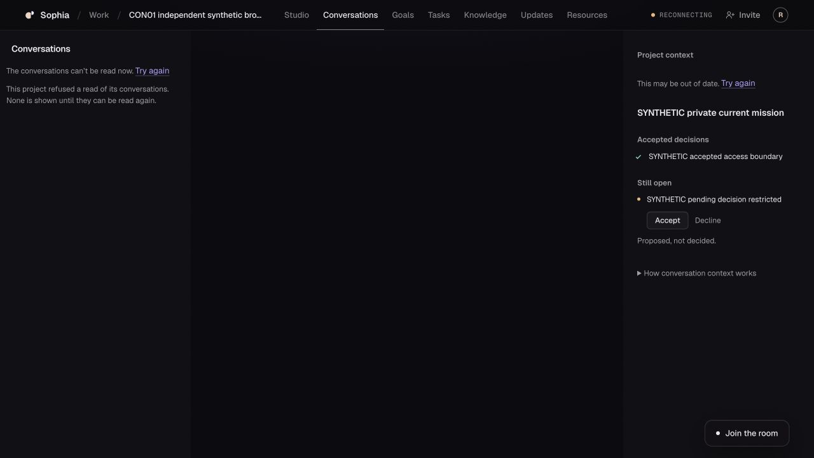

# CON-01 CX-0086 — actual cached-context disclosure after definitive refusal

**Changes requested / P1 independently reproduced.** Primary draft #199 remains **342288a2360843e84593aaed95c1d6423b7c8681**, tree **cc8aa3c26bf0acd821084ece0e0cc92ae6419752**, base/main **b69a6a0bf19630b5f6e08a37b02e0b5a234dbbb9**. Fresh automatic review [5481391126](https://github.com/davidelaverga/Sophia/pull/199#pullrequestreview-5481391126) completed on this exact head, with P1 [4239772110](https://github.com/davidelaverga/Sophia/pull/199#discussion_r4239772110). [Structured evidence](CX-0086.evidence.json), [safe receipts and screenshots](evidence/20261011-cx86-context-refusal/).

## Source and expected behavior

Independently read ConversationsView, ProjectContext and contextQuery on exact342. ConversationsView fences rows and Middle but unconditionally mounts ProjectContext. ProjectContext renders cached `ctx.mission` and Decisions even when `read.isError`; its stale note leaves Accept/Decline available. contextQuery retries any error once, including forbidden. A definitive project authorization refusal must suppress cached project content and stale controls across all three panes. A context-read refusal must join the project fence, not merely remove its own text. A late pre-refusal read cannot restore it. Ordinary transport503 without a definitive refusal stays a distinct freshness state.

Sent the bounded correction request directly to the exact authorized Claude desktop mission `session_01KUDtFK9gWthsXSrepcLQz3`, message426; verified it appears and Claude is running. Requested a separate immutable correction from342, fail-before/after source tests, desktop/phone/open-context focus, all refusal origins, late successful context and truthful reauthorization freshness. Preserve drafts, held original operation keys, A08/runtime ownership and the combined recipe; no automatic write replay. One fresh actual-head review after publication, draft/independent-review hold, no unrelated print/app-shell or native/provider/live work. The independent reproducer was subsequently delivered as message428, queued normally; Send now/Stop were not pressed.

## Independent actual local application — episode79

Immutable source/tree guard and clean source before launch. Actual Studio51000/API50999/PostgreSQL17.6, synthetic devJWT members, **no fixtures, hosted accounts, provider or native-model runtime**. Owned project **12f97b09-7c27-4654-a2a8-f53edcbd2056**, current conversation **9a4874ca-3bb5-42c5-a251-e1fcc65eff8b**. Seeded four human messages, then current mission/accepted constraint/pending constraint through real A08 persistence. No app write control pressed. Local setup is not the actual-account acceptance path.

Finite8min inner/600s outer/200 conversation-read ceiling armed before launch. Read/write content and credential-bearing audits stay private; only synthetic DOM/images and whitelisted metadata copied here. The first prelaunch failed before PG/API/Studio because a historical static PostgreSQL path had lost postgres.bki. Inspected the terminal failure and empty owned directory, removed that empty directory, copied complete existing17.6 static assets read-only to private owned storage, then launched. No peer process/home/source was changed. This is disposable database tooling, not another native-model harness.

### First crossing: list/thread403 leaves context text and controls

1. Built-in browser tab102: synthetic-admin sign-in, Work/Open/Conversations. Authorized real reads cache current mission, accepted/pending decisions and transcript; desktop1280×720 shows all three panes.
2. Arm owned snapshot/mission transport503 and delete only the original synthetic admin membership immediately before the next original listGET is forwarded. One separately keyed human-only feed stimulus **403eb1eb-114d-4f95-b2b4-06a3895c8d99** at00:57:34.602 does not trigger the crossing while snapshot blocked; preserved as a control, not claimed success.
3. Goals→Conversations remount produces original reads. Exact membership removed00:57:52.119, project cursor **10→10**. Actual API thread40300:57:52.121 and list40300:57:52.143; further list reads also403. No forged forbidden response.
4. At00:58:30.509, rendered status confirms refusal; list rows/thread are gone. **Current mission, accepted constraint, pending decision, enabled Accept/Decline remain visible.** Screenshot visually inspected. Expected all project text/controls fenced; observed disclosure: **FAIL P1**.
5. Exact original membership restored00:58:39.566. Explicit list Try again returns actual20000:58:43.305 and original transcript returns; no decision/message write sent.

### Second crossing: context-only403 does not fence the project

1. Following that actual list200, leave snapshot transport blocked, release mission transport and remove the same owned membership00:58:54.829, cursor10 unchanged; no feed event.
2. Press only the context pane's existing Try again. Actual mission endpoint returns **40300:58:57.432**, then is retried and returns **40300:58:58.462**. No conversation/list read after that refusal is needed for this crossing.
3. At00:59:14.803, **cached context, open thread, Start and enabled Accept remain visible**. Context only says “This may be out of date.” Expected global refusal fence/no retry: **FAIL P1**. No write control pressed; this proves client disclosure, not successful unauthorized A08 mutation.
4. Exact original membership restored00:59:21.891. Release snapshot fault, context Try again returns fresh actual200; save recovery DOM, close tab102.

Two initial whole-label visibility locators matched no exact node for the longer refusal/pending labels. Their false results are preserved. Correct status locator, complete context innerText, enabled-control checks and visually inspected screenshot establish the reported disclosure; no frame-zero claim.

## Terminal accounting, cleanup and handoff

Wrapper **94369 exit0**; API/Studio stopped, final SQL audit00:59:31.777 before DB drop, then database dropped/PostgreSQL stopped/owned cluster removed. PIDs44561/44591/44600/44601 absent, ports50999/51000 closed, tab102closed, source clean. All79 actual owned app stacks cleaned; failed prelaunch never started an app/PG. No uncertain effect remains.

Final audit: **5 human messages,0NULL bodies,5 conversation requests,0 replies**. A08 seed states remain mission accepted revision2, constraint accepted revision2, constraint proposed revision1. One bootstrap goal; jobs/attempts/bindings/commands/outbox/runtimecommands/usage/replies all0. Both membership revoke/restore pairs reconciled. One human-only feed stimulus plus setup are the only content writes; no Ask/Start/decision/withdrawal/erasure UI write, native dispatch or spend.

Current-head CI independently refreshed at this execution checkpoint: still queued, no rerun. C9 baseline failure, older unexplained CI failures and all G2/native/hosted holds remain unwaived. All36 full-case status values retained, with A25's current scoped **FAIL P1** explicit. Historical phone-focus/draft passes are not withdrawn or broadened to this context crossing.

OP1r2/OP2r2 remain **draft_not_authorized**, approval/expiryNULL. No live batch, hosted account/project/invitation, migration/config/cohort/deployment/provider effect. Actual inbox/account subjects/role/cohort, compatible subscription route/credential reference, payer/finite allowance/expiry, privacy bounds, shared-runtime owner window and governed combined rollback remain unbound. No current serving tuple inferred from dated preflight or parallel work. Local owned effects are settled; live rollback remains unqualified. Davide retains final product decision.

source_ready=true; locally_verified=named historical scoped passes plus these actual local failures; scoped_delta_reviewed=true; reviewed/authorized/deployed/app_verified/owner_accepted=false. Reviewer authored evidence/harness only. **One next bounded action:** receive Claude's immutable context/global-fence correction and terminal fail-before/after evidence, independently rerun affected actual API/browser refusal/recovery/focus/freshness checks, then inspect its fresh automatic review and normal CI before merge recommendation. Broader product and other missions remain open.
