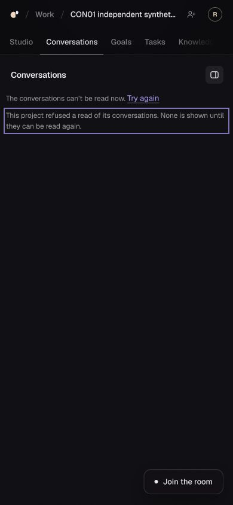

# CON-01 CX-0087 — independent context-fence correction recheck

**Named local crossings pass; release review remains held.** Claude's immutable correction is **a01bda0dc7303d10f1580167e7655b657ba4d48c**, tree **dc8d8d0115a6d166dbc12b1d939a1c7c892e592a**, parent combined342288a2. Main remains **b69a6a0bf19630b5f6e08a37b02e0b5a234dbbb9**. [Structured evidence](CX-0087.evidence.json), [whitelisted receipts, DOM and images](evidence/20261011-cx87-context-fence-recheck/manifest.json). Historical CX86's exact342 P1 failure remains evidence; these passes concern the correction only.

## Source and qualification

Independently inspected all seven changed Studio files (+353/−11), including the six-case regression spec and fixture additions. No API, PostgreSQL, contracts, migration, runtime/artifact, A08 wire, app-shell, report/print or unrelated vision change. The combined recipe is unchanged. `refusedAt` survives fence lifting; mission reads carry their start order; forbidden is not retried; context's own refusal raises the common fence; stale mission content remains hidden until a post-refusal read returns. The phone panel closes and focus retries after inert cleanup. Held operation keys remain in the account/project store; no automatic write replay was introduced. Reviewer authored no feature change.

Independent clean detached worktree: `/Users/davidelaverga/Documents/Codex/2026-10-09/sophia-con01-context-fence-review`; frozen offline installation exit0 and Studio typecheck exit0. Source clean before and after actual-app run. Author [source receipt](https://github.com/davidelaverga/Sophia/issues/198#issuecomment-6104107746) and [terminal receipt](https://github.com/davidelaverga/Sophia/issues/198#issuecomment-6104144709) report static/contracts/unit exit0 (1217 units), focused fixture browser181/181, PostgreSQL16 persistence22/22 and API10/10. The author's regression mutation produced6/6 failures on342 source and18/18 passes after correction. These are attributed author results; the independent tests below use the actual local API and PostgreSQL, not those fixtures.

Fresh exact-head [automatic review requested](https://github.com/davidelaverga/Sophia/pull/199#issuecomment-6104145917) at01:21:26; no result observed at01:23 checkpoint. Normal head CI queued, no manual rerun. Earlier baseline C9 and unexplained app-auth/personal failures remain unwaived. PR199 stays draft; PR226 stays frozen3b1a7ea6/draft. PR190 has independently advanced to **ceed13d8199166935a8a26cc47e98d21b2bc4d53**, merging main's early signed-in script into its app-auth fixture/build repair; its checks are queued. That separate source has not been adopted or represented as qualified in CON's tuple. Other runtime owners and live missions retain their reservations.

## Actual local signed-in application — episode80

Actual Studio52288/proxy API52287/PostgreSQL17.6; synthetic devJWT admin/editor/viewer identities. Project **e8eaf781-7b93-4a58-836d-89cf3895e5d8**, current conversation **90c3345e-0441-4da3-901a-1c4b8bb80b23**. Browser tab103 signs in through the app, Work/Open/Conversations; desktop1280×720 then phone390×844. Four initial human messages and three current mission/constraint decisions were seeded through real persistence, not UI fixtures. This is L1; synthetic identities do not qualify the required hosted account creation/join path.

Finite8min inner/600s outer, read ceiling200 (52 observed, never contained). Private HTTP fault controls operate only this owned local proxy: mission/list/snapshot503 are explicitly synthetic transport failures; every claimed403/200 is the original actual API response. No app Send, Accept/Decline, Start, withdrawal or erasure action was pressed. Shift focused Accept without activating it. The composer retained `SYNTHETIC preserved context fence draft`; checked Ask was never submitted.

1. **Ordinary503, no refusal — PASS scoped.** Goals→Conversations remount under mission/list503 retains cached context with “This may be out of date. Try again.” Distinguishes transport failure from access refusal.
2. **Original list403 — PASS scoped.** Owned admin membership removed immediately before forwarding the original listGET at01:15:31.593, cursor9→9. At01:15:38.781 rows/thread and mission/accepted/pending decisions/Accept are absent; common refusal and context notices visible. Exact restoration01:15:44.493; explicit list retry returns actual200.
3. **List recovered but context503 — PASS scoped.** Old mission stays hidden; terminal state truthfully says context cannot be read, with Retry. Draft returns unchanged. Release mission fault, press context Retry: fresh actual200 restores mission/decisions and original draft.
4. **Context-own403 — PASS scoped.** Revoke admin01:16:18.766, unchanged cursor9; context Retry receives actual mission40301:16:21.486, raises global fence, list40301:16:21.519. At01:16:27.367 context content/actions, open thread and Start are absent; visible global note holds focus. Exactly one mission403 in the observed≥11s window, no retry. Exact restoration01:16:32.591 and explicit list retry produce new list/context200; draft retained.
5. **Late original context200 — scoped post-release observation passes; consumption limit explicit.** Actual mission200 fully buffered01:19:34.291 before revoke01:19:38.900. List retry returns original40301:19:41.619. Explicit release01:19:44.124 hands original bytes to an open client (`clientAlreadyClosed=false`), Node finish01:19:44.125. Browser01:19:48.421 still has zero Accept/open thread and only context fence note. This establishes ordered original transport and the subsequent rendered fence; Node finish is not independent proof of browser query consumption, nor frame-zero proof. Restore01:19:53.149/list and fresh context200 recover draft.
6. **Phone open-context/focus — PASS scoped.** At390×844 open Context; focus Accept without activation01:20:04.515. One uniquely keyed editor human-only persistence feed stimulus01:20:09.551 moves cursor. Proxy revokes original admin01:20:09.707, cursor10→10, before original listGET40301:20:09.717; concurrent mission20001:20:09.728 cannot restore content. At01:20:21.674 the panel is closed, Accept absent, focus is the visible refusal paragraph. Screenshot visually inspected. Exact restoration01:20:29.731, list/context200, draft retained. The snapshot fault after revocation prevents the outer project gate masking this crossing.

No instantaneous/no-frame disclosure claim. Unknown held-A08 key crossing is source-reviewed and author-fixture-tested in this correction; its historical actual evidence is not promoted to a new exact-head execution. `useFenceFocus` changed, so prior new-form/composer focus passes require their affected recheck before whole G3 acceptance. All36 full acceptance case status values remain retained; no full A25/privacy or G2/G3/G4 acceptance is inferred from these named cases.

## Effects, cleanup, operation and next handoff

Wrapper **65167 terminal0**, owned wrapperPID46679. API/Studio stopped before final SQL audit **01:20:43.375** (audit exit0), then DB dropped, PostgreSQL stopped and owned cluster removed. PIDs46679/46706/46719/46720 absent; ports52287/52288 closed. Tab103 closed, temporary viewport reset; source clean. All80 actual owned stacks cleaned. Four revoke/restore pairs settled. Private phone receipt initially copied the first list receipt by mistake; corrected from the current original revocation receipt (01:20:09.707) before export. No credential/raw private audit copied to Git.

Final audit **5 human messages,0NULL bodies,5 requests,0 replies**. Three A08 seed states unchanged (mission acceptedrev2, constraint acceptedrev2, constraint proposedrev1); bootstrapgoal1. Jobs/attempts/bindings/commands/outbox/runtimecommands/usage0. Setup plus one editor human-only stimulus are the only content writes. No model/native/provider or operational work, spend or uncertain local effect. Disposed data were synthetic and explicitly owned; live governed-data rollback remains unqualified.

OP1r2/OP2r2 **draft_not_authorized**, approval/expiryNULL. No hosted project/account/invitation/configuration/migration/cohort/deployment/merge/native-provider effect. Owner chose optionC, per-reply disposable writable home and subscriptions only. Actual inbox/account subjects/role/cohort, compatible subscription route and credential references, payer/finite allowance/expiry, privacy bounds, shared-runtime owner window and governed combined rollback are still unbound. No current live tuple inferred from dated preflight or parallel work; exact installed composition must be recensused before an approved batch. G2 useful provider-backed answer, quota display, host-copy isolation/cleanup/withdrawal/restart remain unqualified.

source_ready=true; locally_verified=named scoped passes; scoped_delta_reviewed=true; reviewed/authorized/deployed/app_verified/owner_accepted=false. Davide retains product acceptance. **One next bounded action:** inspect the fresh exact-head review and normal CI; if source holds, independently recheck affected composer/new-form focus before merge recommendation. Any new material source change invalidates the affected evidence. No autonomous follow-up or broader mission completion.
