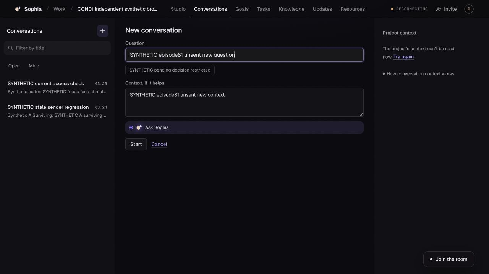

# CON-01 CX-0088 — stale new-conversation starter after reauthorization

**Changes requested / P1 independently reproduced.** Exact candidate **a01bda0dc7303d10f1580167e7655b657ba4d48c**, tree **dc8d8d0115a6d166dbc12b1d939a1c7c892e592a**, main **b69a6a0bf19630b5f6e08a37b02e0b5a234dbbb9**. Fresh automatic review [5481477213](https://github.com/davidelaverga/Sophia/pull/199#pullrequestreview-5481477213), completed01:24:43, reports P1 [4239851727](https://github.com/davidelaverga/Sophia/pull/199#discussion_r4239851727). [Structured verdicts](CX-0088.evidence.json), [safe evidence manifest](evidence/20261011-cx88-stale-starter/manifest.json). CX87 named context-pane passes remain scoped; they do not qualify another consumer of that cache.

## Source and expected behavior

Independently inspected `NewConversation.tsx` on exacta01. `useStarters` lines66–67 reads the same `contextQuery` and passes `brief.data?.pending` directly to `startersOf`, without the pane's `refusedAt/readFrom` freshness check. Middle removes the new form while globally fenced, but a later valid list read remounts it. Cached pre-refusal pending-decision text then resurfaces while the required new mission read is pending or failed. Every shared-context consumer must withhold that old data until an eligible post-refusal context read succeeds. A successful list read does not make old mission data current.

Bounded correction sent directly to the exact authorized Claude desktop CON mission, message432, queued normally (no Send now/Stop). Request: smallest separate immutable correction froma01 for all contextQuery consumers, shared freshness policy, fail-before/after pending/failed/late old200/fresh new200 and refusal origins; preserve drafts, held keys and manual retries; no API/A08 wire/runtime/vision/app-shell expansion. Claude implements; independent reviewer rechecks. No feature fix authored by reviewer.

## Actual local application — episode81

Clean immutable worktree `/Users/davidelaverga/Documents/Codex/2026-10-09/sophia-con01-context-fence-review`; actual Studio53592/API53591/PostgreSQL17.6, project **23a57084-774e-4273-bf85-4a4caed52829**, current conversation **f605a0e7-c727-48a8-b4e6-f3975af10ea4**. Synthetic devJWT admin/editor accounts, no fixtures/native/provider/hosted effects. Built-in browser tab104 signs in normally through the dev identity page and opens Work/project/Conversations. Finite8min/600s outer and200read ceiling;22reads observed, never contained. Same synthetic persistence setup as episode80: four human messages, three current A08 decisions. Two separately keyed editor human-only stimuli are the only additional content writes. No Send/Start/starter/Accept/Decline/withdrawal/erasure button pressed.

1. **Phone composer focus — PASS scoped.** At390×844 fill/focus unsent composer draft. Human-only stimulus key3fb9c7fa-a1f1-41a0-bc43-09a6f777fab3 at01:25:41.260 triggers original reads. Proxy removes exact owned admin membership01:25:41.406, cursor10→10, before original listGET40301:25:41.409; snapshot transport is blocked afterward to prevent the outer project gate masking the view. At01:25:48.550 composer is absent and visible refusal paragraph is focused. Restore01:25:53.398, explicit list Retry20001:25:56.525 returns exact unsent draft. Concurrent original mission200 is recorded, no resurrection claim beyond observed fence.
2. **Phone new-form focus — PASS scoped.** All conversations→New conversation opens form with authorized pending-decision starter. Fill unsent question and context; keep context textarea focused. Block mission transport, release snapshot once, arm exact owned revocation before next list. Second human-only stimulus key7ed49a7e-e0cc-4f02-a051-4b79a79a95aa at01:26:14.286. Membership removed01:26:14.428, cursor11→11; original list40301:26:14.430. At01:26:20.349 new form/starter absent and visible refusal paragraph focused. Exact restoration01:26:25.976.
3. **New form recovery with fresh context unavailable — FAIL P1.** Explicit list Retry returns original20001:26:28.689 while mission transport still returns controlled503. New form remounts, both unsent fields intact, but **enabled “SYNTHETIC pending decision restricted” starter resurfaces from the old cache**. At desktop1280×720, the pane beside it truthfully says “The project’s context can’t be read now. Try again” and hides its old content. At01:27:22.096 the stale starter remains enabled (`disabled=false`) with both drafts intact. DOM and screenshot independently captured; image visually inspected. This proves disclosure after refusal/recovery, not a successful unauthorized write. No frame-zero assertion or claim of perpetual failure was needed; terminal failed-read state persists in the observed interval.
4. Release mission fault and press context Retry; original fresh mission20001:27:29.426 restores context. Save recovery DOM, reset temporary viewport and close tab104.

## Cleanup, operation and handoff

Wrapper **49846 terminal0**, PID48340. API/Studio stopped before final SQL audit **01:27:37.702** (audit exit0), then disposable DBdrop/PostgreSQLstop/cluster removal. Owned PIDs48340/48366/48375/48376 absent, ports53591/53592 closed, tab104closed, viewportreset, sourceclean. All81 actual owned stacks cleaned; both revoke/restore pairs reconciled. No uncertain local effect remains.

Final **6 human messages,0NULL bodies,6 requests,0 replies**; three seeded decision states unchanged (mission acceptedrev2, constraint acceptedrev2, constraint proposedrev1). Bootstrapgoal1; jobs/attempts/bindings/commands/outbox/runtimecommands/usage0. Human-only traffic caused no paid/model or operational work. Spend0. Credential-bearing source/audits remain private; only23 whitelisted receipts/DOM/image exported.

Current PR199 stilla01/draft, normalCI queued at01:28 checkpoint; fresh review now has the independently confirmed P1. No duplicate review request/manual rerun. PR226 frozen3b1a/draft, mainb69 unchanged, PR190 currentceed13d8 separate/unadopted. BaselineC9 and older unexplainedCI failures remain unwaived. G3 changes_requested/G4held. All36full acceptance status values retained with A25 current failure explicit. Phone focus passes concern exacta01 only and are invalidated if the correction changes their shared mechanism.

OP1r2/OP2r2 draft_not_authorized, approval/expiryNULL; no hosted account/project/invite/migration/config/cohort/merge/deployment/provider effect. OptionC/per-reply isolated home/subscriptions-only decisions remain binding. Actual inbox/account subjects/cohort/role, compatible route/credentialrefs, payer/finitecap/expiry, privacy/shared-runtime owner window/governed rollback remain unbound. No current serving tuple inferred from old preflight. Native useful answer/quota/home cleanup/crash/withdrawal, actual two-account hosted app acceptance and live rollback remain unqualified.

source_ready=true; locally_verified=named scoped passes plus currentP1failure; scoped_delta_reviewed=true; reviewed/authorized/deployed/app_verified/owner_accepted=false. Davide retains product acceptance; other missions/product remain open. **One next bounded action:** receive Claude's smallest immutable all-consumer freshness correction plus fail-before/after terminal evidence, independently rerun affected actual browser refusal/recovery/freshness cases, then examine fresh exact-head review and normalCI. No autonomous monitoring or post-session promise.
