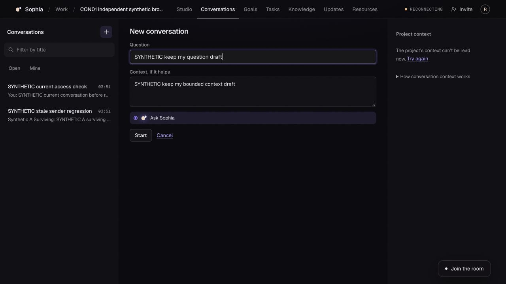

# CON-01 CX-0090 — immutable all-context correction independently rechecked

**Named correction passes independently; whole release remains held.** Exact **d527f3854222020abb6ba723bf0ea7480c76bb82**, tree **72b89db438b57e7eaaeb6be802dc1ae4049c8b6d**, parent a01bda0d; main **b69a6a0bf19630b5f6e08a37b02e0b5a234dbbb9**. [Structured evidence](CX-0090.evidence.json), [safe artifacts](evidence/20261011-cx90-all-context/). This corrects CX88's independently reproduced starter disclosure for the named actual crossing. CX88 remains the historical a01 failure. No feature fix authored by reviewer.

## Exact source and independent checks

Requested publication of already committed d527 on a separate review-only branch in exact Claude desktop mission message438, allowing independent review while its existing terminal checks ran. Author [6104313009](https://github.com/davidelaverga/Sophia/issues/198#issuecomment-6104313009) returned `claude/con01-all-context-review`; independently fetched, verified full SHA/tree/single parent, created detached clean `sophia-con01-all-context-review`. No reset/branch rewrite/new PR.

Read complete7file +346/−21 delta and surrounding consumers. `ContextRead/readSince/briefNow` now gate every context cache consumer, including NewConversation, disabled ProposeHere observer, held-decision's `briefSays` and post-await latest store check in useAlreadyOpen. ProjectContext uses the shared read-order predicate. The additional CX89 absent-cache truthfulness feedback is implemented: success plus actual eligible data required; missing/pending/failed/fenced/old data is unknown. Repository source/search found no other conversation context consumer. No API/db/contract/migration/runtime/Studio-shell/report/vision paths changed. Keys/heldwrites/server semantics retained. Independent Node24.21.0/pnpm11.7.0 frozen offline install0, StudioTSC0, **31tests/9suites/0fail/0skip**. Command selected decide/new-conversation tests plus nonexistent proposed-truth.test.ts; Node omitted that selector, so no proposed-truth unit claim. Source remained clean.

Read author terminal [6104365132](https://github.com/davidelaverga/Sophia/issues/198#issuecomment-6104365132): exact same bytes, format/lint/typecheck/contracts/unit1222/focusedfixturebrowser188/PG22/API10 exit0, pre/post clean. Exact committed fail-before spec gives7fail/6pass on a01. This is attributed author evidence, not an independent rerun. Receipt says all new tests end with fresh200; source phone case ends with failure/no-starter checks instead. Sent precision correction in message440, no source change requested.

## Actual local episode82

Owned disposable **PostgreSQL17.6 + API55463 + Studio55464**, synthetic devJWT identities, project **db75d3e1-f243-4f5d-8d75-c2ca154c7769**, current conversation **39c0d496-287a-47fe-aa30-d85cf5b09597**. This is actual app/API/persistence L1, no conversation fixtures, hosted account or native/provider route. Preparation bound exact SHA/tree; wrapper rejects unbound/dirty/mismatched source. Eight-minute inner/600-second outer/200read ceiling; actual23reads, no ceiling containment.

1. Actual local admin opens project/Conversations/Newconversation. Current eligible pending starter visible; fills question/context drafts. Ordinary local503 for list/mission/snapshot across Goals→Conversations remount truthfully marks stale and retains eligible starter/drafts. Reopens form after navigation; no claim form selection survives navigation.
2. Release mission503, hold next complete original authorized mission200: buffered **01:52:15.338**. Remove exact owned admin membership immediately before forwarding listRetry: original API403 **15.639**, cursor9 unchanged. Form and context disappear. Release original200 **15.846**, clientopen/Nodefinish15.847. Subsequent DOM remains fenced. This is original-byte transport and independently observed DOM proof, **not separately instrumented browser-consumption/framezero proof**.
3. Block feed and mission; original feed streams destroyed under finite control. Existing editor uses actual least-privilege API-role `withActor/decideMissionChange` to **reject one existing synthetic pending constraint** at revision1, stablekey **e507445a-25a1-4b11-b8bf-864e933871b3**; committed **01:52:26.936**, decisionrevision2/cursor10. No direct content SQL or UI decision press. Private helper initially spelled wire choice decline; caught from actual SQL before launch, corrected to reject, syntaxchecked. No failed effect occurred.
4. Restore exact original admin membership **35.561**, explicit listRetry actual200 **38.250**, mission still locally503. Form returns with both drafts, **no pre-refusal pending starter**, context withholds old words and offers truthful Retry. Desktop screenshot visually inspected; this is the same CX88 failing crossing now passing. Controlled snapshot/feed faults explain topbar Reconnecting, not global app readiness.
5. At390x844, DOM shows both fields/nooldstarter/nohorizontaloverflow. Backend phone captures are390x219 scaled desktop JPEGs, so excluded from mobile visual proof. This limitation is explicit; no visual phone acceptance inferred.
6. Release missionfault and actual contextRetry: original200 **01:52:57.045**. Current mission and accepted boundary return; **Nothing waits for a decision**, no retired starter. Both drafts intact. Fresh current data, not merely hidden content. No UI Start/starter/Send/Ask/Accept/Decline/erasure/withdrawal pressed; no human feed stimulus was needed.

## Accounting, cleanup and rollback

Wrapper **51595exit0**. API/Studio quiesced before final SQL audit **01:53:10.518exit0**, then owned DBdrop/PGstop/clusterremove. Four owned PIDs51595/51626/51635/51636 absent, ports55463/55464 closed; tab105 closed, viewportreset, candidateclean. All82 actual owned stacks settled; no uncertain local effect/cleanup debt. Setup alone created4human/4requests/0NULL/0replies. Three A08seed decisions: acceptedmissionrev2, acceptedconstraintrev2, targetedconstraintrejectedrev2. Bootstrapgoal1; jobs/attempts/bindings/commands/outbox/runtimecommands/usage0. No native/provider call or spend. Raw bodies/JWT/dbURL remain private; only whitelist metadata and synthetic DOM/images exported. Screenshots returned JPEG bytes, exported under correct jpg names. No model reply/native/disposable-home cleanup claim from these results.

Live rollback is not qualified: no live effect occurred. Previous immutable source and governed additive data policy retained; no production rollback/drop/destructive injection. Any future rollback must block admission/settle/reconcile and preserve current authorized reads/erasure; reverting UI alone does not settle asks.

## Current holds and handoff

Independently refreshed #199: d527/baseb69/draft/open/unmerged. #226 remains frozen3b1a; #190 ceed13d8/baseb69/draft/open/separate, not adopted. Refreshed historical WBC PR107 and SDD issue103 receipts only: no new runtime authority/live readiness inferred. Parallel Paperclip mission remains active; no unrelated UI/source/effect action sent. Current serving app/API/runtime/artifact tuple remains unproven. Dated LIVE_PREFLIGHT stays historical.

One fresh exact-head automated review requested [6104365613](https://github.com/davidelaverga/Sophia/pull/199#issuecomment-6104365613). **Independently read actual bot result [6104392647](https://github.com/davidelaverga/Sophia/pull/199#issuecomment-6104392647), 01:56:15UTC, exactd527f38542: no major issues.** This is automated source evidence, not release acceptance. Author CC85 [6104395144](https://github.com/davidelaverga/Sophia/issues/198#issuecomment-6104395144) acknowledges/corrects the phone-test receipt without source changes. Named context P1s r4239772110 and r4239851727 independently replied/read-verified then scoped-resolved via [4239922378](https://github.com/davidelaverga/Sophia/pull/199#discussion_r4239922378) and [4239922476](https://github.com/davidelaverga/Sophia/pull/199#discussion_r4239922476). No whole-PR approval. Normal runs38103277135queued/38103277223pending, push38103272790 and38102842903queued; no manual rerun. Earlier LinuxC9/older unexplainedCI/native/hosted holds unwaived. All36 full acceptance **status values retained**; A25 gains this scoped correction evidence, not whole acceptance. G3 named correction locally_verified, fullG3open/G4held.

OP1r2/OP2r2 **draft_not_authorized**, approval/expiryNULL; no hosted project/account/invite/email/schema/config/cohort/merge/deploy/provider effect. Owner decisions retained: optionC, isolated throwaway harnesshome perreply, subscriptiononly/noPAYG, newproject and secondactualsyntheticaccount. Existing inbox question unanswered; actual owner-controlled inbox/subject/role/cohort, compatible subscriptionroute/credentialrefs/payerfinitecapexpiry/privacy/shared-runtime ownerwindow/combinedartifact/governedrollback remain unbound. No credentials or account identifier invented. LocaldevJWT is not hosted two-account acceptance; CLI quota/context labels are not Sophia subscription monitoring. G2 usefulness/correlation/disposable-home/crash/withdrawal/cumulativeallowance qualification remains open.

source_ready=true; locally_verified=named scopes; scoped_delta_reviewed=true; **reviewed/authorized/deployed/app_verified/owner_accepted=false**. Sent actual result/limits directly in exact Claude mission message440. Davide retains final product acceptance; broader product and other missions remain open. **One next bounded action:** recover the current G2 remaining implementation/ownership proposal against accepted D6/B1, while retaining the exactd527 queued-CI hold; no shared edit or live effect without its actual bound authority. No autonomous monitoring or later-session promise.
