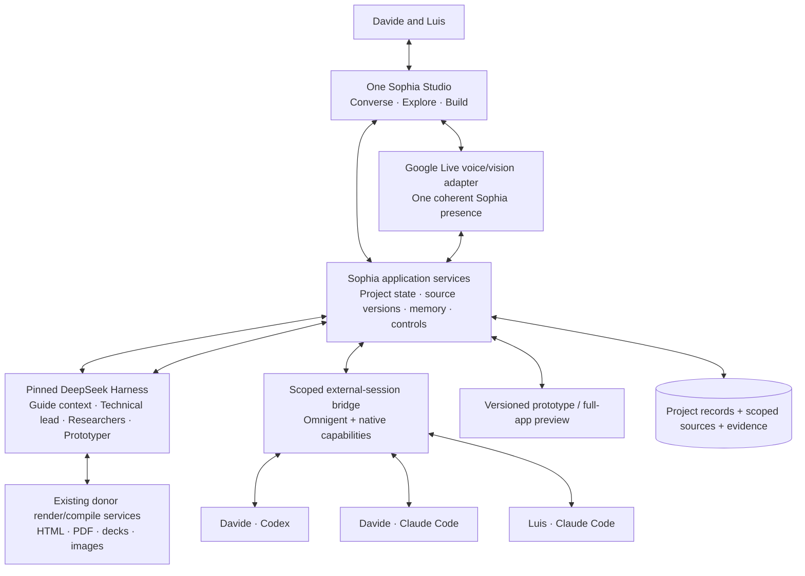

# Sophia — three complete releases on DeepSeek Harness
## Product and implementation plan · draft v0.2 · 24 September 2026

**For:** Davide and Luis  
**Status:** Revised planning draft. The user's latest choices are reflected below; implementation defaults and estimates remain proposals. No integration, deployment, or benchmark is certified by this document.  
**Replaces:** `Sophia_DeepSeek_Harness_Three_Sprint_Product_Plan_Draft_v0.1_2026-09-23.md`, without modifying its bytes.  
**Research companion:** `Sophia_Project_Bridges_Donor_Review_and_Plan_Changes_v0.2_2026-09-24.md`.

> **First release:** bring your existing project context, speak and create together, turn a selected design into a real UI prototype, and supervise Davide's Codex, Davide's Claude Code, and Luis's Claude Code from one Sophia workspace. Review the running application, tell Sophia what must change and what must remain, and see the technical lead steer the work. Native desktop approval remains an explicit first-release handoff.
>
> **Second release:** richer cooperation and attention, precise source-preserving artifact edits, scenario testing, and mobile/in-app control where the underlying execution route permits it.
>
> **Third release:** sustained project follow-through, adaptive execution teams, a native supported application-building profile, and measured procedural learning.

These are three **release sprints**, not three two-week promises. Each finishes with a coherent product used for real work. There is no preceding infrastructure-only release and no requirement to complete the old Sophia repair backlog first.

---

## 1. Decisions and precedence

### 1.1 What stays locked

Sophia is one user-facing cooperative guide. The technical lead owns project-management responsibility: what to build, the roadmap, dependency judgments, the execution arrangement, progress assessment, and proposals when direction should change. A coordinator inside a goal's execution team is subordinate to that project responsibility. Workers can challenge and communicate directly within their mandate.

DeepSeek Harness/Cordis is the foundation for Sophia-owned reasoning. Build a clean core with out-of-tree Sophia bundles and a pinned runtime. Do not migrate the existing companion middleware chain wholesale. Preserve useful artifact engines, source/version structures, data meaning, voice transport, and regression knowledge selectively.

Voice, research, creative artifacts, memory, good UI/UX, and a learning loop remain first-release capabilities. Converse, Explore, and Build remain lenses over one project. External agents initially perform general application implementation; Sophia performs research, document creation, design exploration, and real frontend prototyping itself.

Model-provider independence is architectural. The initial portfolio is small and explicit, with separate model/effort/tool settings for different roles. A coding subscription is an execution resource, not a general-purpose inference key for dsh.

### 1.2 The user's changes from v0.1

| Area | v0.2 decision |
|---|---|
| External execution | Both vendors in Sprint 1, with all three actual owner-bound resources, not Codex first and Claude later. |
| Existing projects | Add context intake and local project/session linkage in Sprint 1. Distinguish supported snapshots/handoffs from unverified continuous vendor-project synchronization. |
| Native prototyping | Image directions must lead to real editable frontend source in Sprint 1; Luis can work with that source inside Sophia. |
| Co-review S1 | Visual review → explicit change/preserve brief → technical-lead amendment → worker execution → actual result review. |
| Exact edit enforcement | Move general component-scoped mutation/preservation machinery and full artifact edit UX to Sprint 2. Versioning, source retention, and honest limitations remain in S1. |
| Supervision | Add a real periodic technical-lead review plus event-triggered and manual review in Sprint 1. Do not substitute an idle indicator for semantic assessment. |
| Permissions | S1 identifies the exact owner, resource, request and native place to act. S2 adds in-app resolution for supported request types. |
| Product connectors | No Notion, Supabase-management, or Vercel-management connector prerequisite in S1. Existing engineering routes use already authorized services. Internal application storage is not being deferred. |
| Attention | S1 ships streamed visibility and required-action alerts. S2 adds the richer milestone/cooperation selection and presentation policy. |
| Mobile | S2 targets useful remote project control; push/deep-linked owner notification is the minimum supported outcome for actions that still require a native surface. |

Latest user decisions override earlier proposal schedules. In particular, older text-first, Strands-core, private-data-in-Git, mandatory assumption scoring, delayed peer communication, and protected-editing-in-S1 proposals are not silently inherited.

---

## 2. Product shape and architecture

The boxes define responsibilities, not a requirement for a microservice per box. Keep application state, the scheduler and adapters together initially where practical. Keep untrusted generated code and rendering/browser workers isolated. Existing Python renderers can remain bounded jobs called from the TypeScript application/runtime boundary.

### 2.1 dsh is the agent runtime, not a public multi-user server by assumption

Use a supported named profile, scoped capabilities, native model/tool mechanisms, PTC and native context/replay facilities. Product authentication, membership, accepted decisions, publication and effect permissions are Sophia responsibilities. Do not expose dsh's local development surface as the public product backend.

Use a separately scoped runtime home and workspace for each appropriate project/execution trust boundary. Native Agent Teams provide useful local communication, not arbitrary cross-host authorization. Product goal readiness must not be inferred solely from a native task marked `completed`.

### 2.2 One stable project, several execution strategies

The technical lead can select a solo worker, a same-runtime coordinator/worker pair, or an authorized cross-harness team. It explains the choice in terms of the goal, fit, availability and user preference for speed, savings, or depth. It may decide not to use all available resources.

A multi-model arrangement is not a permanent model hierarchy. Neither `high` effort nor a vendor name is an automatic claim of quality. Record the actual provider, model, effort and runtime configuration used.

### 2.3 Core product records, kept small

| Logical record | Why it exists |
|---|---|
| Project and mission revision | Shared purpose, accepted constraints, members and unresolved choices. |
| Source/context import | Original provenance, owner, scope, version and coverage of imported material. |
| Decision/amendment | What changed, who authorized it, affected source/goal, and relevant evidence. |
| Goal/work/attempt | Durable obligation independent of one agent session; dependencies and current candidate. |
| Resource/team assignment | Owner, host, runtime session, capabilities, role, permitted work and allowance. |
| Peer message/receipt | Attributed communication and delivery status without introducing another mission authority. |
| Human action/review result | Pending request or lead decision, exact target and resolver. |
| Artifact/preview/evidence | Source and asset lineage, current stable output, candidates, observations and checks. |
| Memory/learning | Scoped preferences and knowledge, with provenance and correction/retirement behavior. |

These can be tables and object-store records in one ordinary application backend. A readable project brief/wiki is a projection and knowledge aid, not a competing mutable source of authority.

---

## 3. Bringing existing ChatGPT and Claude projects into Sophia

### 3.1 Product promise

**Continue the work you already started elsewhere without reconstructing it from memory.** The first release supports real context intake and linked local engineering projects; it does not promise a universal personal-account API for continuous two-way synchronization of vendor Projects.

There are different objects behind the word “project”:

| Origin | First-release route | Honest boundary |
|---|---|---|
| ChatGPT UI Project | Import selected conversation/export content, project files and instructions supplied by the owner; retain authorized source links. | A ChatGPT API project is not that chat workspace. An account export is a snapshot, not an automatic live Project connection. |
| Claude.ai Project | Import selected exported conversations plus owner-supplied project knowledge/instructions and source links. | Export documentation does not guarantee every project asset or latent context is included. Inspect the actual exported representation and report gaps. |
| Local Claude Code / Codex project | Link the chosen repository/worktree, selected project instructions, allowed documents, and an owner-selected session or handoff. | Repository access is not permission to ingest all home-directory memories, all chats, or vendor credentials. |
| Vendor-hosted coding project/threads | Retain selected source/PR links and authorized exported handoffs; support a live route only when a documented interface for that exact object is available. | No screen/cookie scraping or private API dependency to imitate an unsupported connector. |
| A user request inside a supported ChatGPT/Claude MCP environment | A thin **Send to Sophia / Update Sophia brief** tool can publish explicit task context to an authenticated Sophia project. | This is a user-initiated handoff. Installing the tool does not grant Sophia a reverse API to enumerate all vendor history. Availability must be checked on the actual account/surface. |

The last row is an S1 integration experiment with a usable snapshot/import path underneath it. It must not block the three-engineer workspace if the account or client cannot use that bridge.

### 3.2 Intake workflow

1. Choose **Start new** or **Continue an existing project**.
2. Select sources. For a large personal export, prefer local/browser-side selection and upload only selected material rather than uploading the entire personal archive by default.
3. Show an inventory: included conversations, instructions, files, dates and authors when present; unsupported entries and missing assets remain visible.
4. Sophia drafts a current-project understanding: purpose, selected decisions, current source/repository, open questions, work already completed, and relevant evidence.
5. The owner corrects that understanding. Sharing source material and accepting a project decision are separate actions; an old assistant answer is not automatically an accepted decision.
6. Start the first project goal using the accepted current frame, while keeping the imported source available for explanation.

Store an importer version, original source ID/path/URL where available, captured timestamp, hash and content coverage. Unknown authorship or project grouping stays unknown. Handle duplicate imports and later snapshots without rewriting old provenance. A new import conflicting with an accepted decision produces a proposal, not an overwrite.

Use clear connection states: **Imported snapshot**, **Linked repository**, **Connected execution session**, and **Live source sync** only when the last state actually exists. A link can be retained without claiming its private content was fetched.

### 3.3 Optional portable handoff format

A small project handoff package can include `project.md`, `decisions.md`, `open-work.md`, `sources.json`, and selected assets. This is a proposed interoperability format, not a new database or compulsory user ceremony. A Sophia MCP tool or a vendor assistant can prepare a candidate package; its coverage is still checked.

Do not import system instructions, subscription credentials, implicit private memory or automation permissions as project authority. Material that is hidden behind a source link does not become readable merely because the URL was imported.

### 3.4 Current research boundary

Official documentation establishes personal exports, project sharing, local session mechanisms, and external MCP tools. This research did not establish a general public personal-account interface to enumerate and continuously control every ChatGPT/Claude Project. Enterprise compliance interfaces are a distinct authorized product path, not a shortcut for Pro/Max users. See the companion ledger for exact sources and the unavailable Claude Code cloud Projects page.

---

## 4. Sprint 1 — Our shared creation and engineering workspace

### Complete product

Davide and Luis can bring real context, speak with Sophia, research, generate documents and design directions, make a runnable UI prototype, refine it together, and have their **three connected engineers** integrate it into a real application. They see what each engineer is doing, what is unknown, why the technical lead changes course, and which native action a particular owner must take.

### S1-01 — Studio, project and voice

**User value:** one place for conversation, creation, current work and return.

- Build the new Studio using the actual `Sophia_Studio_V1_Evolved_V2_R1.html` as a visual/interaction reference, not as production networking code.
- Preserve one Sophia dock, a large current artifact, local Converse/Explore/Build lenses, contextual discussion and a compact work pulse. Shared focus is distinct from each person's local navigation.
- Support two authenticated participants from the first release, attributed text/voice contributions and an explicit shared-guide handoff. The guide role does not transfer account credentials or all project authority.
- Deliver actual Google Live interaction, follow-up, barge-in, text fallback and selected-artifact visual observation. Use a simple explicit addressing policy initially; richer consented discussion-following is S2.
- Keep talking while research, rendering and implementation continue. Stop speaking, stop observing and stop work have different effects, presented contextually rather than as seven permanent buttons.
- Start a native generation or external goal from any lens; do not force navigation first. Show a result bridge rather than hijacking everyone's view.

**Owners:** Luis leads Studio/identity/audio-client integration; Davide leads Sophia behavior, project workflows and provider/runtime integration. Both implement; review cross-boundary changes together.

### S1-02 — Context intake, project memory and first learning

**User value:** the project begins with the work already done and improves the next brief.

- Implement the intake workflow in section 3 for selected ChatGPT/Claude exports, files, handoffs and linked local repositories.
- Provide the optional user-initiated MCP handoff probe; show exactly what arrived and what did not.
- Persist accepted mission, decisions, project preferences and current work separately from the imported history. Direct reads resolve current agreement; retrieval explains history and evidence.
- Preserve personal/project boundaries and correction/Forget behavior. Private material is not written into a shared Git wiki. A provider purge can be pending while future use is already blocked, with that distinction visible.
- At a goal close, capture evidence and a compact useful lesson; retrieve that lesson in the next relevant brief. Explicit feedback does not automatically become a lasting preference.
- Provide a small source-linked repository/state-of-build overview. A full automated wiki generator is not needed to correctly answer what exists, what is mocked and what was checked.

**Owners:** Davide leads intake/retrieval/learning workflows; Luis leads scoped data and API boundaries.

### S1-03 — Research, imagery, HTML/PDF and decks

**User value:** Sophia creates useful work even before an application build is needed.

- Native sourced research, document intake and evidence-linked answers.
- Voice-initiated image directions through a separate image-generation job; approved asset/version, intended use and provenance remain attached to the project.
- Real HTML/PDF documents and PPTX decks using selectively imported render/compile capability from existing Sophia. Add images through the selected asset path, with no claim that text-only legacy decks already prove it.
- Explicit economical and stronger/reviewer profiles, including a same-runtime pair on one substantive research/artifact task. Use a solo worker for simple work.
- Retain source and stable candidate versions. S1 revisions are supported at an honest brief/source-revision level; exact component-scoped edit guarantees are S2.
- The old companion chain is not required to invoke the reused rendering capability. A temporary legacy creation bridge must declare its limits and have an extraction/removal condition.

**Owners:** Davide leads runtime/recipes/renderer integration; Luis reviews artifact display and publication behavior.

### S1-04 — Native UI prototype workshop for Luis and Sophia

**User value:** turn a visual idea into code the engineering team can actually integrate.

- `Reference + intent → distinct design directions → selected direction → runnable UI prototype`.
- Start with one supported source stack, proposed React/TypeScript/Vite, while respecting an existing target repo's conventions where known. Do not prescribe this stack to every eventual customer repository.
- Generate real components, styles, assets and interaction state. A picture of a website is a concept reference, not a functional prototype.
- Include ordinary state fixtures such as empty/loading/error/success when relevant. Implement a basic state picker directly; a full scenario authoring/testing workbench arrives in S2.
- Offer `Preview / Source / Diff` and a bounded code editor so Luis can change a component/style in Sophia, save a candidate and rebuild. This is deliberate source editing, not a promise of universal natural-language surgical edits.
- Keep the accepted source/assets and prior usable preview. Concurrent human edits cause reconciliation rather than being overwritten by an older worker result.
- Use selected Impeccable guidance as a skill; do not let its aesthetic defaults replace the team's chosen identity or redefine the mission.
- Produce a handoff with exact source/asset versions, accepted behavior, current repo/base, mock-to-real map, preservation instructions and required checks. The technical lead hands this to the engineers without recreating the design from screenshots.

**Owners:** Luis leads prototype workspace/source editing/preview; Davide leads dsh generation, source packaging and technical-lead compilation.

### S1-05 — All three engineering resources and live goal teams

**User value:** use the tools the founders already pay for, collaboratively, from the first release.

| Resource | Owner | Execution surface |
|---|---|---|
| `davide-codex` | Davide | Owner-authenticated Codex, mapped through supported native capabilities |
| `davide-claude` | Davide | Owner-authenticated Claude Code |
| `luis-claude` | Luis | Owner-authenticated Claude Code |

- Integrate both vendors in the same release through a pinned Omnigent adapter and native interfaces where appropriate. Do not build two independent metaharnesses.
- Owners register/authorize their actual hosts and sessions. Use an owner flow to launch or adopt a session; shared READ/EDIT access is not assumed to authorize spawning on another person's host.
- Record actual model/effort, owner/payer, availability, connection state, active work and observable usage. Distinguish unavailable data from zero cost or zero progress.
- The technical lead selects a solo worker, a goal coordinator plus worker, or a coordinator with two independent workers when the task supports it. All three resources must be usable; keeping them all busy is not an objective.
- Prove direct bidirectional peer communication during work, with questions, challenges and evidence. Software routing does not add a technical-lead model hop for each message.
- Use source-isolated worktrees or equivalent permitted working areas, integration ownership, exact source handback and one release operator for shared production effects.
- Permit routine in-scope steering under an explicit project/session grant. Native permission denials and reserved effects remain distinct; do not make every ordinary steer require another user click.

**Owners:** Luis leads host/session adapter and resource UI; Davide leads team strategy, goal briefs and native/external message integration.

### S1-06 — Visibility, heartbeat review, alerting and steering

**User value:** stop constantly checking three agent windows to learn whether attention is needed.

- Stream meaningful worker events into a shared current-work view with source freshness and last observation. Show runtime activity separately from assessed progress.
- Introduce a server-owned periodic review, proposed default **every five minutes while relevant work is active**, configurable by project. Event triggers and the manual **Review work progress** action use the same review procedure.
- Each due review inspects the current goal, evidence/diff/check summaries, outstanding questions and changes since the last review. It makes a real technical-lead judgment, not only a timestamp update.
- Outcomes include continue, report, request evidence, send a steer, issue a fresh alignment brief, ask for independent review, hold affected work for replanning, or ask the proper human.
- Show review decisions and reasons in the project activity/current-work view. Applied material changes receive a visible notification and a way to challenge or amend them. No-change reviews update “last reviewed” without generating a distracting card each time.
- Owner-specific permission cards identify resource, host/session, requested operation, scope, reason, age and the native place to act. S1 requires the owner to resolve these in the original application where necessary; Sophia verifies resolution from the adapter rather than trusting “I clicked it.”
- Handle native close, failure, known external wait and missing telemetry differently. A long test is not automatically a loop. A fresh commit is activity, not automatically fulfillment of the accepted goal.
- Keep Stop, Hold, manual review and new guidance accessible. One review can be outstanding per project; scheduled and manual triggers coalesce without losing the user's question.

**Owners:** Davide leads review and replan procedures; Luis leads event reconciliation, scheduler, controls and alerts.

### S1-07 — Full application preview and visual review-to-steer

**User value:** judge the actual product and change the worker's direction from Sophia.

- External engineers use their existing authorized database/deployment tools. Sophia does not require new Notion/Supabase/Vercel management connectors.
- Require a result with exact commit/tree or source snapshot, build and run instructions, environment, preview address, test/check records, mock/real distinctions and remaining gaps.
- Render a complete representative application in Sophia through an isolated embeddable preview or scoped remote-browser view. A private localhost URL is not automatically reachable from the other person's device. Do not bypass a host's framing/auth restrictions or share broad browser cookies.
- Capture the version/viewport and an annotation or selected element where available. Sophia confirms an ambiguous target before translating it into a request.
- Compile a **change/preserve brief**: what changes, what stays, why, exact preview/source, applicable acceptance criteria, and allowed effects.
- The technical lead reconciles it with active work and delivers it using the adapter's supported steer path. Preserve the distinction between recorded, delivered, reflected in a candidate, and checked.
- Return a candidate preview and inspect it with the team. S1 can discover and repair unintended changes; it does not claim general mechanical non-target preservation across arbitrary artifacts.

**Owners:** Luis leads review/preview integration; Davide leads change/preserve compilation and execution follow-through.

### S1-08 — Use the product for an actual shared outcome

A complete release episode:

1. Bring selected prior Sophia project material from ChatGPT/Claude and a real working repository into a project; correct one stale imported statement.
2. Davide and Luis talk with Sophia, research one question and compare generated design directions.
3. Sophia produces a runnable UI. Luis changes one part in the source view; the accepted source and assets become the integration handoff.
4. The lead allocates work across the three registered resources. A coordinator/worker pair exchanges a useful question during execution; a third resource performs a separate bounded task or review without racing the same mutation.
5. A worker requires Luis's native permission. Sophia names the correct resource and user; he acts in the native app; the request resolves from actual observed state.
6. A timed review checks substantive progress. It either justifies continuing or produces a useful corrective decision. One manual review is also exercised.
7. A whole-app preview appears in Sophia. The team specifies one change and one preservation constraint, and the worker returns an inspectable revision.
8. Reconnect during work; issue Stop with a pending message in a separate controlled case; no duplicate goal or late unauthorized continuation follows.
9. Return to the project and use a real lesson from this cycle in the next brief.

Every connected resource participates in actual permitted work during the release demonstration. No fabricated quota, deployment, worker event or imported source coverage is used to make the demonstration appear complete.

---

## 5. Supervision and peer communication: the small first implementation

### 5.1 Three mechanisms, three jobs

| Mechanism | Job | Model work? |
|---|---|---|
| Runtime telemetry and connection heartbeat | Know which process/session is observable and current. | Normally no. |
| Peer mailbox | Carry a collaborator's question, answer, finding or handback promptly. | Only the recipient's useful interpretation; no mandatory PM paraphrase. |
| Project review heartbeat | Reconsider progress, alignment and next action periodically. | Yes, one bounded technical-lead review for the project snapshot. |

Events are not a substitute for the periodic review, and the periodic review is not a replacement for promptly delivering a peer's blocking question.

### 5.2 Proposed review policy

The five-minute interval is a starting setting, not an empirically optimal number. Combine all three workers into one project snapshot rather than performing three near-identical lead calls. Include direct links to more evidence, so the lead can inspect a decisive error instead of guessing from summaries.

Do not repeatedly spend model calls on an unchanged known permission wait. Track the waiting condition, owner and next review/resolution event. Manual review always obtains a current assessment within the applicable resource allowance. If observation is unavailable, report that and reconcile; do not award progress or presume stagnation.

At five minutes, continuously active work creates at most twelve scheduled project reviews per hour before coalescing. Three separate timers would create thirty-six. This is scheduling arithmetic, not an inference-cost estimate. Count reviewer, summarizer, search and peer-response usage too.

A correction follows `review snapshot → proposed action → current-scope/version check → send/apply → observe → inform`. A changed goal or Stop invalidates an old review decision. One ordinary failed test can warrant repair, not a project pivot. A broader scope/spend/mission change remains a human decision unless expressly delegated.

### 5.3 Direct collaboration without communication loops

Use compact attributed messages with goal, assignment generation, sender, recipient, reply-to, evidence references and whether a response blocks a particular action. No separate “received” model message by default. Readbacks are bounded; full logs stay in scoped evidence storage.

Native dsh teammates use the native durable mailbox and step-boundary delivery. External sessions use a capability-aware bridge to their native control path. Do not assume dsh's in-process Team can simply adopt an arbitrary remote vendor session.

A2A may carry an independent service boundary; MCP can expose model-facing Sophia operations. Neither protocol authorizes work or guarantees immediate consumption of a message. Distinguish delivery from model inclusion and useful response; do not falsify the latter when the adapter cannot observe it.

A peer message is not human authorization. New work or expanded authority requires current admission. An old session cannot take over a newer assignment because a timestamp looks stale. The latest mailbox-v2 source is a useful reference for session epochs, author ownership and operator handoff, not a global requirement that one vendor always coordinate the other.

### 5.4 Production collision prevention

Keep one assigned release path for a shared environment and require the exact candidate, expected current deployment, current permission and settlement of the prior effect. Source worktree isolation does not isolate database migrations or production.

Because S1 uses existing broadly capable external tools, an application lock alone cannot guarantee prevention of an out-of-band manual deployment. Configure the relevant launch/CI/hook path where supported, and disclose residual out-of-band risk. Do not claim perfect enforcement from a prompt or a local mutex the tool can ignore.

---

## 6. Sprint 2 — Precise cooperation and remote project control

### Complete product

The shared workspace becomes a place to inspect meaningful milestones, test alternative behaviors, make precise revisions, answer supported approvals and steer work from a phone. Required operational actions and optional opportunities to improve the result no longer compete as identical alerts.

### S2-01 — Semantic attention and notification dynamics

Preserve the established four presentation layers—Work Pulse, Cooperation Opportunities, Control Rail, and Inspector—while keeping required Human Actions semantically separate from optional invitations:

| Layer | User-facing purpose |
|---|---|
| Process/Work Pulse | What Sophia and the engineers are doing; latest meaningful change; last verified/observed state. |
| Human Action | Required, owner-addressed, persistent until resolved, cancelled or superseded. Dismissal never means approval. |
| Cooperation Opportunity | Optional invitation tied to a useful partial result, meaningful choice or expertise that could improve the outcome. |
| Control Rail | Stable, current controls without making the person operate a runtime console. |
| Inspector | Expandable source, execution and verification evidence without crowding the artifact. |

Extend the existing heartbeat and event review with one question: **Is there a real milestone or choice worth the team's attention now?** If yes, capture its exact artifact/source, purpose, author, deadline or relevance window, and what happens without a response. The lead may return no opportunity.

Publish only a captured, still-current result. An old screenshot must not masquerade as the live candidate. Deduplicate related updates; coalesce routine progress; keep blocking actions accessible independent of the optional-card limit. A card can open the exact result in another lens without changing everyone's local view.

Allow Accept/Continue, Change, Ask/Reflect, Later, or Decline according to the type. Routine status, an optional suggestion and an authorization request must not share one ambiguous “Done” button. Record usefulness and later outcomes separately from detector accuracy; clicks and dismissals are not automatic truth labels.

### S2-02 — Full co-review and protected artifact editing

- Persist component/source manifests and approved assets for HTML/PDF/deck/UI routes that support them.
- Use expected versions and target selectors, bounded mutation scopes, candidate validation and atomic publication.
- Resolve the actual target through source/text plus the selected visual view. Confirm consequential ambiguity, not every trivial action.
- Verify protected sibling source and important appearance/behavior. Package metadata changes in a regenerated PDF/PPTX are not automatically preservation failures.
- Apply natural-language scoped edits and Luis's direct source edits through compatible candidate/version contracts.
- Explain when a requested change legitimately affects layout or behavior beyond the target and obtain the applicable revised mandate.
- Do not pretend every arbitrary imported PDF or screenshot is reversibly editable source. Preserve original; reconstruct only with a declared new-artifact operation.

### S2-03 — Experience scenarios and browser verification

Turn S1's state fixtures into versioned, replayable scenarios. Use Storybook for suitable components/pages, MSW for controlled service behavior, and Playwright for full-app interaction checks and traces. Keep the native artifact and scenario state in the same source family.

Separate three meanings of replay:

1. **dsh agent replay:** fixed model streams through the real loop to test runtime/control behavior.
2. **UI scenarios:** defined component/application states and simulated interactions.
3. **Real application tests:** actual integration/preview execution with assertions and evidence.

A successful first type proves neither the second nor production correctness. Retain one live end-to-end episode alongside cheap replay coverage. Dsh's current replay first-call-order binding also needs special care for concurrently starting sibling sessions.

Add source-linked recorded-video review and convert useful discoveries into repeatable tests. Computer-use observations propose findings; executable checks and appropriate human review determine what has been verified.

### S2-04 — In-app and mobile actions

- Render supported native permission requests in Sophia with exact target, command/scope, actor and expiry. Resolve them only through the underlying supported approval interface.
- Mobile web supports Review work progress, view candidate, comment, issue a steer, Hold/Stop and decisions under the same grants as desktop.
- Vendor login, OS prompts, some 2FA, or an unavailable host may still require the owner/native environment. Keep an explicit native handoff instead of simulating success.
- Deliver mobile notifications through one selected channel/PWA push integration. A push is not guaranteed delivery or action; persist the underlying request and expose read/resolution independently.
- Test stale approval, revoked membership, replayed tap, source changed since preview, and Stop before late login/approval returns.

**Minimum release fallback:** reliable owner-addressed notification and a mobile view of the exact request, with an honest link/instruction to the native surface. Never delay all mobile usefulness until every native dialog can be proxied.

### S2-05 — Richer voice and human cooperation

Add the consented follow-this-discussion mode, labelled per-participant contributions, one output coordinator and meaningful optional cards without mandatory speech. Test EN/IT/ES and mixed correction/negation cases. “Sophia” in a quoted sentence or “don't ask Sophia” must not always trigger speech.

Use the Buzz human-floor/generation pattern to suppress stale speech after interruption, while preserving a separate durable-work lifecycle. Ending a voice exchange does not cancel the build; taking control of a preview does not approve a deployment.

### S2-06 — Broader project sources and first-party connectors when needed

Introduce selected Notion sources/publishing and user-facing Supabase/Vercel management connections only where they now save a real workflow. Keep the already working external service path usable. These are not prerequisites for S1 database work or deployment.

Expand project intake with an incremental, user-approved update flow; support the thin Send-to-Sophia MCP route on confirmed eligible clients. Do not promise private vendor-project synchronization if no suitable documented API is available. Enterprise source integration is a separate permission/product decision.

### S2-07 — Knowledge, review and bounded adaptive policy

Maintain the state-of-build page after real changes and refresh relevant repo knowledge from source diffs. OpenWiki/OKF-style source-linked pages are reference patterns, not a competing authority or a mandatory new agent runtime.

Improve automatic review with actual useful/false/missed cases; permit a distinct independent reviewer when the technical lead needs it. Keep relevant prior attempts in a bounded evidence packet rather than imposing historical blindness.

Allow tested model/effort/specialist adjustments and explicit resource-profile changes at safe boundaries. Add Jev only as a measured optional classifier for a concrete decision bottleneck, not as a mandatory new platform or a writer of the team's beliefs.

### S2 release episode

Review a real development milestone captured by the lead, try loading/error/success scenarios, revise one confirmed component while preserving protected siblings, and send an application amendment to the active engineers. Resolve one supported permission from mobile and one unsupported request through an explicit native handoff. Continue across a reconnect, record a project lesson, and use it in the next brief.

---

## 7. Sprint 3 — Adaptive project continuity and native application execution

### Complete product

Sophia carries a real project across sessions and weeks, chooses and adjusts a working team within the team's constraints, learns which procedures help, and can itself implement a supported end-to-end application feature rather than relying exclusively on external engineers.

### S3 capabilities

**Long-horizon project management.** Roadmap, goals, dependencies, exact current decisions and unfinished obligations survive every worker session. Delayed events, quota exhaustion, host loss and new evidence lead to reconciliation or a permitted reassignment, not blind retries. A weekly overview is produced from actual project records, with no requirement to keep a premium coordinator generating continuously.

**Native full-stack profile.** Extend the dsh worker from research/prototypes into a supported application feature: code, development data changes, integration, tests, preview and a user revision. Use the same handoff, candidates, resource records and acceptance contract as Codex/Claude. This is not a universal arbitrary-repository claim.

**Adaptive working teams.** Choose solo, same-runtime pair, cross-harness pair, or independent parallel work from a small evaluated portfolio. Preserve user priorities and current budget when changing a route. Record actual settings and why the change happened. Availability or a blocked tool is not permission to route around an account or policy denial.

**Composition that earns its place.** Cordis can compose approved roles/tools/skills/context policies for the next episode. New configurations are versioned candidates. No automatic plugin installation or rewriting of permission/budget controls under the label of adaptation. Prime-like persistent computation or Pi/SoL-Pi can be separately admitted later if a measured workload needs them; they are not compulsory parallel foundations.

**Project and procedural learning.** Separate what someone said, what the team decided, what happened, what we infer, and what may be retained. A value/preference is not a falsifiable market claim; an experiment result can inform a broad assumption without resolving it universally. Propose changes with evidence and a no-change option. Test recipe changes against the current version and fresh work before promotion, retaining rollback.

**Team/customer operation.** Repeat real use with design partners, monitor resource consumption and human repair, clarify account requirements, and make source/artifact/knowledge export practical. Gather commercial feedback before this sprint too; completed pricing validation is not inferred from a short pilot.

### S3 release episode

A team returns after time away. Sophia explains completed work, current uncertainty, pending choices and the next useful goal. A user selects savings over speed. The lead assigns a suitable coordinator/native-worker arrangement, escalates a genuinely hard question and de-escalates routine work. The native worker delivers a real integrated feature; a previous lesson prevents a repeated mistake. The resulting evidence changes one procedure or justifies keeping it.

---

## 8. Feature progression and scope integrity

| Capability | Sprint 1 | Sprint 2 | Sprint 3 |
|---|---|---|---|
| One Sophia / three lenses / shared project | Real, usable | Refined attention and multi-party flow | Sustained cross-session use |
| Voice and selected visual input | Real two-person guided interaction | Discussion-following, multilingual and mobile refinement | Longer operation and resource optimization |
| ChatGPT/Claude project continuity | Selected context import; repository/session link; optional MCP handoff probe | Refresh/handoff productization; supported additional sources | Broader integrations only with actual interfaces |
| Davide Codex + Davide Claude + Luis Claude | All connected and participating | Improved controls/diagnosis | Adaptive combinations |
| Peer communication | Direct messages during work, capability-aware | Stronger remote controls and recovery | Broader compositions |
| Technical-lead supervision | Periodic + event + manual; real decisions | Milestone invitations and better review policy | Multi-week replanning and learned configuration |
| Native research/PDF/HTML/deck/image | Real capability | Better precise edits and quality recipes | More efficient tested workflows |
| Native UI prototype | Runnable source + Luis source editing + handoff | Full scenario workspace and protected edits | Native integrated application feature |
| Full application preview | Real returned app visible/reviewable | Stronger inspection/testing/co-review | Native and external routes equivalent in product records |
| Artifact revision | Candidate/brief-level; no universal exact guarantee | Component-scoped enforcement on supported sources | Broader supported coverage |
| Permission actions | Alert exact owner; native resolution where required | In-app/mobile for supported types; native fallback | Same policy across more routes |
| Optional cooperation opportunities | Manual/obvious first-slice interaction; no elaborate selector | Deliberate milestone policy and full card lifecycle | Evidence-informed selection |
| Notion/Supabase/Vercel product connectors | Deferred; engineers use existing tools | Add selected workflows | Expand by demand |
| Memory and learning | Correct scoped current state + source/lesson recall | Stronger wiki/feedback/cycle proposals | Measured procedural improvement |

Do not remove a baseline capability merely to report the next sprint complete. A later connector or native coder is a new route, not a new project database or a redesign of every UI object.

---

## 9. Source and donor strategy

The detailed ledger records sources and limitations. The working dispositions are:

| Source | Adopt/adapt | Do not import by default |
|---|---|---|
| DeepSeek Harness | Native runtime, scoped composition/PTC/context, local team mailbox and replay tools | Public unauthenticated multi-user exposure; advisory write scopes as enforcement; test replay as a production simulator |
| Omnigent | Pinned host/session bridge, supported vendor adapters, observation and controls | Its product UI as Sophia; direct-child topology as project ownership; treating posted as consumed |
| Buzz | Attributed event/reply routing, meaningful handbacks, anti-ack-loop rules, human floor and stale-output generations | A second Nostr workspace/identity system; wholesale Rust/Tauri/mobile stack; claim of already complete push/approval workflows |
| QM | Scope-aware harness contract, attributed durable mail, completion reconciliation and selective-response pattern | Private-to-team auto-carry, token-custody architecture, broad organizational dashboard, passive mail assumed to wake every recipient |
| Impeccable | Relevant design skill/critique/audit guidance and explicit product vs design references | Automatic aesthetic replacement of Sophia or user-selected style; uncontrolled hook installation |
| Storybook + MSW | S2 component/scenario and service-fixture tooling | A mandatory engine before the first prototype works |
| Playwright | S1 render/capture/build smoke; S2 real-app assertions and traces | Treat screenshots or generated tests as proof without running and checking them |
| PinchTab | Optional S2 browser audit/text-first exploration candidate | A second browser service until useful; public multi-tenant operator exposure |
| Symphony | Eligibility/poll/reconcile/workspace principles | Another installed project scheduler competing with Sophia/dsh |
| Existing Sophia | Render/compile services, source manifests, scoped mutation primitives, consent/Forget semantics, voice normalization and tests | Companion middleware chain, interrupt-as-steer, whole-artifact regeneration as exact editing, model-authored completion truth |
| Earlier Library work | Studio V2-R1 geometry; view/focus/work distinctions; pulse/required/optional/control grammar; evidence-linked learning | Old sprint numbering, fixture claims as production proof, obsolete mandatory calibration/mission-change incentives |

Implementation must record the license and exact source revision before copying code. Reading a pattern does not require installing its whole project. A changed default-branch README is not a qualified production dependency.

---

## 10. Foundations that must be correct from the start

**Authority without ceremony.** Users can grant routine project-scoped operation once. Repeated identical questions are not a safety feature. Broader spending, access, mission changes and public effects still require their applicable authority. A vendor permission prompt remains a vendor permission prompt.

**Source continuity without a premature universal editor.** Store actual source/asset versions and candidate/stable distinction in S1. Add component protection in S2. Do not postpone versioning until exact editing, and do not quietly advertise exact preservation before enforcement exists.

**Memory correctness.** Retrieval uses current scope and source eligibility. Corrections/Forget affect future prompt construction, summaries, indexes and controlled caches. Imported vendor output is evidence, not an automatically accepted rule. Existing data migration never revives deleted or rejected material by re-extraction.

**One continuation owner per route.** Repeated review is not repeated authorization to start another identical task. Native goal loops manage their admitted run; the product lead controls the next work episode. Stop invalidates queued work, old review actions and late results as appropriate; cancellation acknowledgement is not settlement of every external effect.

**Context economics.** Bounded relevant packets and expandable exact sources; no transcription of three entire histories into every review. Provider-neutral roles use a small tested portfolio. Record cached/input/output/auxiliary usage when available, including failed attempts; absent subscription usage is unknown, not zero.

**Private runtime boundaries.** Do not share one dsh home, filesystem or account credential surface across unrelated owners merely because they are in the same UI. Generated code, remote browser content and imported documents are untrusted inputs. No automatic execution of imported project hooks or skills.

**One coherent experience.** A card is a projection of an existing request/result, not a separate business object per lens. Local browsing does not seize shared focus. Closing a panel, ending audio or dismissing a card does not implicitly cancel work or resolve a decision.

---

## 11. Incremental build order inside Sprint 1

These are integrated increments of one release, not additional sprints or a long pre-product qualification phase.

| Increment | End-to-end output | Primary coordination |
|---|---|---|
| A | New project/Studio + dsh guide + real voice exchange + selected-source intake | Davide runtime/intake; Luis state/Studio/audio |
| B | One native research/HTML/prototype job returns a real preview; Luis edits source and saves a new candidate | Davide creative recipe; Luis source/preview |
| C | All three owner resources registered; actual session observation, permission alert and a manual progress review | Luis adapters/events; Davide review procedure |
| D | Periodic reviews and direct peer question/reply steer a real goal; Stop/reconnect retain correct obligations | Shared contract ownership; one editor per seam |
| E | Prototype source handed to external engineers, integrated and deployed using existing service access, co-reviewed in Sophia | Luis handoff/preview; Davide lead/worker coordination |
| F | PDF/deck/image paths, source/memory correction, next-brief learning and complete real-user episode finished | Both, with actual usage evidence |

Prototype/image/artifact work and external adapter work can proceed in parallel after the shared request/result identities are agreed. Do not make one owner complete every backend prerequisite before the other can use a real component. Integrate frequently; fixtures can support development but do not count as release evidence for a live feature.

Each work package ends with a usable route, a concise source/change record and the relevant behavioral tests. Do not re-run an expensive full multi-format campaign for a localized change whose effect can be verified directly.

---

## 12. Acceptance, operations and economics

### S1 essential cases

- Selected imports retain provenance; a missing private file is reported rather than fabricated; a stale imported belief does not overwrite an accepted decision.
- Two real participants use voice; a background job does not create duplicate narration or accidentally end when speech ends.
- A source-backed prototype is modified by Luis, exported, and built outside its original preview; accepted assets reach the integration worker.
- All three contributed resources execute actual permitted work and exchange at least one substantive peer question/answer without desktop screenshots.
- A permission request is routed to the exact owner, resolved on the supported native surface, and reconciled in Sophia.
- Periodic and manual lead reviews inspect real evidence and produce visible decisions without duplicate interventions.
- A complete application preview is usable in the app; change/preserve intent reaches the correct current worker; its returned candidate is inspected.
- Stop/reconnect/stale assignment cases do not duplicate work or claim an unavailable observation as success.
- A corrected/recalled project memory and a lesson influence the next actual brief.

These are release behaviors, not a 50-session statistical gate. Test the sensitive transitions deterministically and perform a finite real episode. More cases grow from real failures.

### S2 essential additions

A milestone creates a useful captured cooperation card; ignoring it does not resolve a blocking action. An exact scoped edit preserves protected source. Scenarios test real user interactions. A supported mobile approval succeeds and a stale one does not. A native-only approval stays honestly native. Replay of an agent trace is not labeled a live application test.

### Measurement

Track time to first usable prototype, time blocked on avoidable coordination, owner-action latency, source/preservation corrections, human re-prompting effort, delivered-work quality and total usage. Separate guide, technical-lead review, peer coordination, worker, media, render and infrastructure consumption. Subscription limits, API dollars and rough infrastructure estimates are different quantities.

User feedback is not automatically a correctness label. Diagnose whether a warning was useful, whether its proposition was true, and whether the intervention improved work as separate observations. Do not force mission amendments, confidence scores or a topology change to manufacture evidence of learning.

### Time and cost planning

The broader S1 is a substantial release: three owner resources, voice, prototypes, rendering and project intake have real coupling. No evidence in this review establishes a precise delivery time.

**Initial sizing assumption for discussion:** with both founders' protected time, agent assistance and successful reuse, hold roughly 5–8 calendar weeks for S1, 4–6 for S2, and 4–6 for S3. These are planning ranges, not dates or guarantees; task sizing and the first integrated increment should update them. Daily use of partial increments starts before a release label is complete.

The scope moved out of S1 is deliberate: first-party management connectors, universal exact artifact editing, an elaborate cooperation selector, broad mobile approval coverage and a large autonomous routing system. Do not put them back as hidden dependencies.

At S1, measure the real model/runtime costs before setting public subscription economics. Use the existing owner-authorized engineering accounts, not pooled account credentials or silent API fallbacks. Budget the project lead and heartbeat explicitly; cap background analysis and reserve for unsettled calls. OpenRouter remains an optional provider-access route, not a new current dependency.

---

## 13. Migration and upstream operation

1. Create the new dsh product route beside current Sophia. Current useful capabilities and outstanding cleanup obligations remain owned until their actual disposition.
2. Inventory each donor by function, current source revision, license, extraction cost, behavior to preserve and removal condition. Reuse the low-level engine when cheaper than porting the wrapper; do not import the long companion chain for convenience.
3. Preserve IDs/provenance for selected migrated records. Users can import a project snapshot without importing all private personal history.
4. Pin the dsh runtime and relevant plugin set as a release unit. Use current `46a7f68b...` only as the review anchor, not an automatically certified deployment version.
5. Exercise a candidate upstream upgrade on representative peer, context, Stop/reconnect and artifact routes. Upgrade between release increments when justified; do not track HEAD on production every day.
6. Keep one adapter around Omnigent and document native capability differences. The reviewed Omnigent `7496d36b...` snapshot is a source anchor, not a guarantee that every HEAD feature belongs in a released package.
7. The new UI's source is not the old explanatory HTML's fixture controller. Reuse its visual identity and semantics, and selectively reuse compatible presentational components.

---

## 14. Source basis and remaining uncertainties

This draft draws on the original v0.1, the migration reassessment v2.0, the latest execution-team and mailbox clarifications, the actual Studio V2-R1 HTML and its iteration specification, the Shared Coreview teaching module, relevant creative handoff and semantic-attention Library material, historical Claude plan critiques, and fresh public documentation/source inspection.

The public sources and private file identifiers, findings, contradictions and donor dispositions are registered in the companion ledger. The following remain unverified by this review: the actual installed vendor models and permissions, a live three-resource session, exact export file coverage, provider-project automatic sync, long two-person voice behavior on the chosen route, app preview authentication/embedding, and whole-task savings from any particular model pair.

These uncertainties become short concrete implementation questions inside the first useful release. They are not invitations to restart foundation selection or to replace the user's chosen experience with a passive dashboard.

**Result to aim for:** Sophia becomes the place where the team thinks, makes a prototype, directs its existing engineers, sees what really happened, and carries its decisions forward. The execution machinery may improve later without making the project start again.
